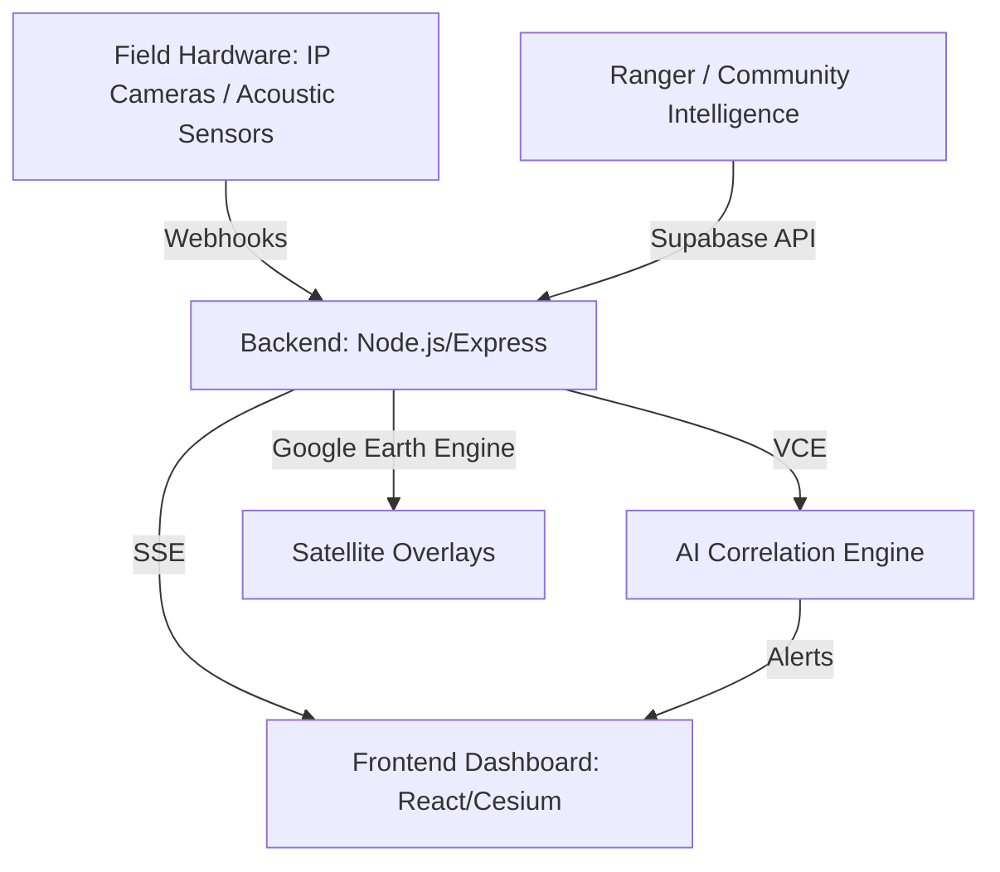

# Vanguard System Architecture

Vanguard is designed as a multi-tier intelligence platform that bridges the gap between field hardware (sensors, cameras) and strategic decision-making (ranger dashboards).

## 1. High-Level Flow

## 2. The Vanguard Correlation Engine (VCE)

The VCE is the heart of our platform. It resides in `backend/server.js` and processes every incoming signal through a 30-minute rolling window.

### Rules of Triangulation:
- **Rule A: Triple Correlation.** If 3+ events occur in a single zone within 30 minutes across 2+ source types (e.g., Acoustic + Camera), the VCE fires a **CRITICAL** incident immediately.
- **Rule B: High-Confidence Acoustic.** Gunshot or chainsaw signatures with >0.92 confidence from AI analysis trigger **HIGH** priority alerts.
- **Rule C: Human Presence.** Any camera-detected human presence or community report in an active zone elevates the priority of concurrent wildlife signals.

## 3. Frontend Visualization: The Digital Twin

Vanguard leverages two specialized map engines:
- **CesiumJS (3D):** Provides the macro-view. Sub-meter satellite imagery integrated with Google Earth Engine tiles. Essential for terrain analysis and long-range patrol planning.
- **Leaflet (2D):** The tactical map. Optimized for fast polygon drawing (Estates/Zones) and real-time icon overlays.

### Restructuring Note
The frontend underwent a significant cleanup on April 30, 2024. All "corrupted" files in nested subdirectories (which contained bad script artifacts) were purged. The system now relies on a clean, flat component structure in `src/components/`, ensuring maximum build reliability on Render.

## 4. Integration Hub

Vanguard doesn't exist in a vacuum.
- **Vision:** Direct hooks into Clarifai/HuggingFace.
- **Acoustic:** Logic for harmonic pattern matching (Chainsaws) and impulse detection (Gunshots).
- **Environment:** Live weather telemetry via Open-Meteo.
- **Biodiversity:** Real-time species presence via GBIF.
- **Satellite:** Fire/Thermal event detection via NASA EONET.
